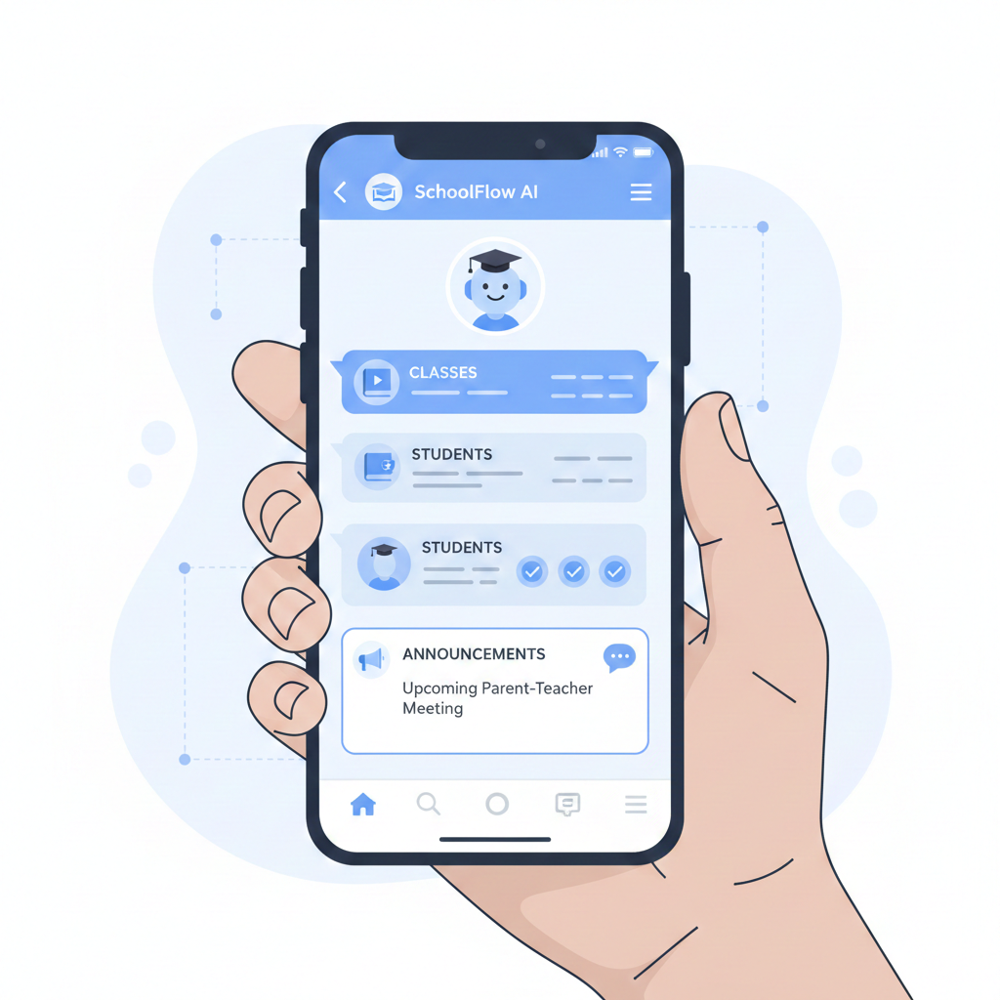
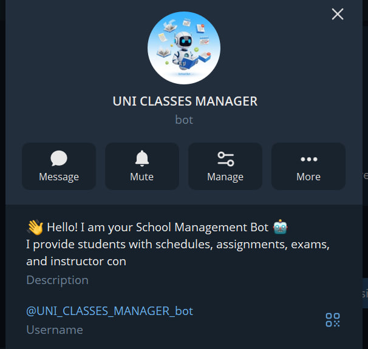

## School Telegram Bot

  

<h1 align="center">School Manager Bot</h1>

  An AI-powered Telegram bot that simplifies school class management through automation and smart interactions.

## 🚀 Features
- 📚 Manage school classes and students
- 📢 Send announcements easily
- 🤖 AI-powered smart responses
- 🧑‍🎓 Student-friendly interaction
- ⚡ Fast and lightweight Telegram bot

- Admins can:
  - Add or update assignments, exams, materials, etc.
  - Real-time updates to the database

## Tech Stack
- Python 3.10+
- SQLite for database
- OpenAI GPT-4o-mini for AI classification
- python-telegram-bot for Telegram integration

## 📸 Screenshots

  
  

## Folder Structure
school-telegram-bot/
├── app/
│ ├── main.py
│ ├── config.py
│ ├── ai/
│ ├── bot/
│ ├── db/
│ ├── services/
│ └── utils/
├── data/
│ └── school.db
├── .env
├── requirements.txt
└── README.md